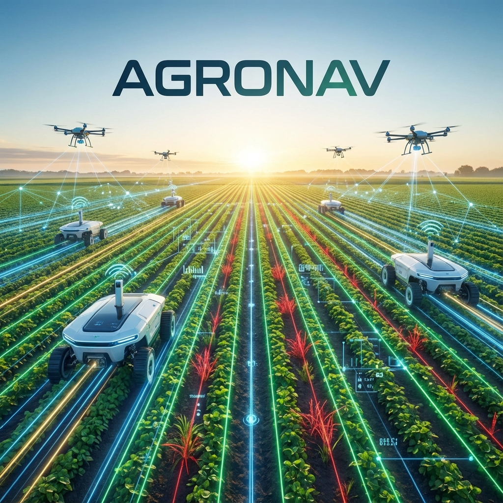

<div align="center">
  
  
  # Agronav
  
  **Autonomous Navigation Framework for Agricultural Robots and Vehicles using Semantic Segmentation and Semantic Line Detection**

  [](https://opensource.org/licenses/MIT)
  [](https://www.python.org/downloads/release/python-380/)
  [](https://pytorch.org/)
  [](http://makeapullrequest.com)

</div>

---

## 📖 Overview

Agronav is a robust framework designed for autonomous navigation in agricultural environments. It leverages state-of-the-art computer vision techniques to enable robots to navigate crop rows effectively.

*   **Semantic Segmentation**: Uses [MMSegmentation](https://github.com/open-mmlab/mmsegmentation) to identify crop rows and traversable areas.
*   **Line Detection**: Utilizes [Deep Hough Transform](https://github.com/Hanqer/deep-hough-transform) for precise semantic line detection to guide the vehicle.

This work was presented at the **4th International Workshop on AGRICULTURE-VISION: CHALLENGES & OPPORTUNITIES FOR COMPUTER VISION IN AGRICULTURE** at CVPR 2023.

[📄 Read the Paper](https://openaccess.thecvf.com/content/CVPR2023W/AgriVision/papers/Panda_Agronav_Autonomous_Navigation_Framework_for_Agricultural_Robots_and_Vehicles_Using_CVPRW_2023_paper.pdf)

<p align="center">
  
  <br>
  <em>Figure 1: Pipeline of the Agronav framework</em>
</p>

---

## 🏗️ Project Structure

```bash
agronav/
├── e2e_inference_image.py  # End-to-end inference script
├── requirements.txt        # Python dependencies
├── segmentation/           # Semantic segmentation module
├── lineDetection/          # Semantic line detection module
├── inference/              # Directory for inference inputs/outputs
├── figures/                # Figures and assets
└── data/                   # (Not tracked) Dataset directory
```

---

## 🚀 Getting Started

### Prerequisites

*   Python 3.8
*   CUDA-compatible GPU (Recommended)

### Installation

1.  **Clone the repository:**
    ```bash
    git clone https://github.com/bahattinyunus/agronav.git
    cd agronav
    ```

2.  **Create a virtual environment (Optional but Recommended):**
    ```bash
    conda create -n agronav python=3.8
    conda activate agronav
    ```

3.  **Install Dependencies:**
    
    First, install PyTorch (adjust `cu116` to your CUDA version):
    ```bash
    pip install torch==1.13.1+cu116 torchvision==0.14.1+cu116 torchaudio==0.13.1 --extra-index-url https://download.pytorch.org/whl/cu116
    ```

    Then install the project requirements:
    ```bash
    pip install -r requirements.txt
    ```

4.  **Install Modules:**
    ```bash
    # Install mmcv
    pip install mmcv-full==1.7.1
    
    # Setup Segmentation
    cd segmentation
    pip install -v -e .
    cd ..
    
    # Setup Line Detection
    cd lineDetection/model/_cdht
    python setup.py build
    python setup.py install --user
    cd ../../../
    ```

---

## 🧠 Training

### Semantic Segmentation
1.  Download the **Agroscapes Segmentation dataset** and extract to `data/agronav/`.
2.  Configure `segmentation/agronav.py` as needed.
3.  Train:
    ```bash
    python segmentation/train-agronav.py
    ```

### Semantic Line Detection
1.  Download the **AgroNav_LineDetection dataset**.
2.  Prepare data:
    ```bash
    python lineDetection/data/prepare_data_NKL.py --root './data/agroNav_LineDetection' --save-dir './data/training/agroNav_LineDetection_resized_100_100' --fixsize 400
    ```
3.  Train:
    ```bash
    python lineDetection/train.py
    ```

---

## 🧪 Inference

Run end-to-end inference on your images:

1.  Place images in `inference/input/`.
2.  Download checkpoints to `segmentation/checkpoint/` and `lineDetection/checkpoint/`.
3.  Run:
    ```bash
    python e2e_inference_image.py
    ```
4.  Results will be in `inference/output_centerline/`.

---

## 🤝 Contributing

Contributions are welcome! Please read our [CONTRIBUTING.md](CONTRIBUTING.md) for details on how to submit pull requests.

## 📜 License

This project is licensed under the MIT License - see the [LICENSE](LICENSE) file for details.

## 🖊️ Citation

If you use this code in your research, please cite:

```bibtex
@InProceedings{Panda_2023_CVPR,
    author    = {Panda, Shivam K. and Lee, Yongkyu and Jawed, M. Khalid},
    title     = {Agronav: Autonomous Navigation Framework for Agricultural Robots and Vehicles Using Semantic Segmentation and Semantic Line Detection},
    booktitle = {Proceedings of the IEEE/CVF Conference on Computer Vision and Pattern Recognition (CVPR) Workshops},
    month     = {June},
    year      = {2023},
    pages     = {6271-6280}
}
```

### Acknowledgement
Financial support from the US Department of Agriculture and UCLA-Amazon Science Hub for Humanity and Artificial Intelligence.
